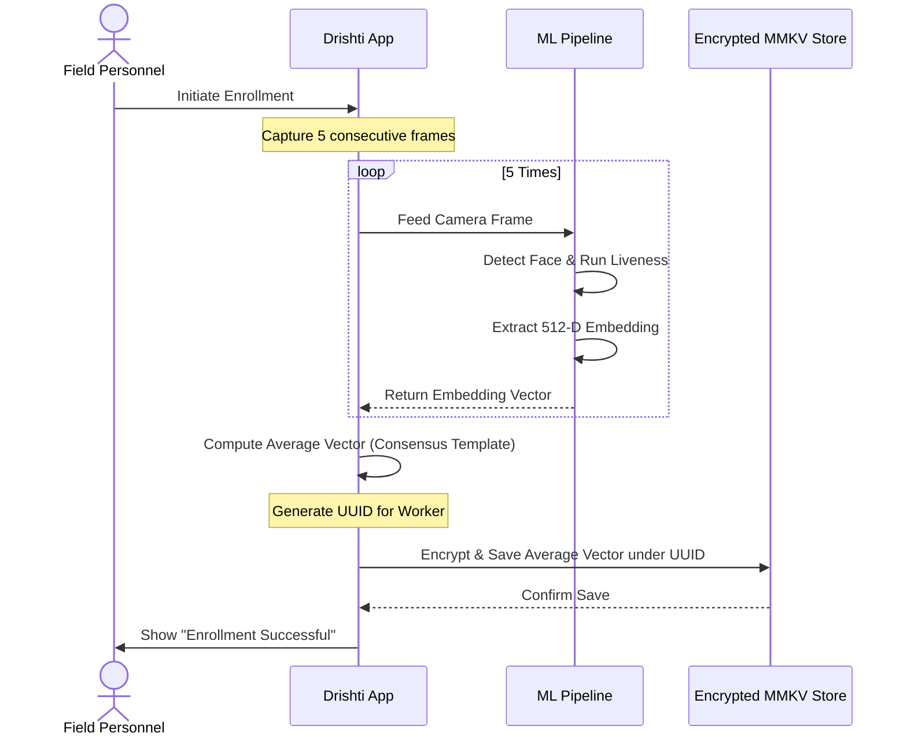
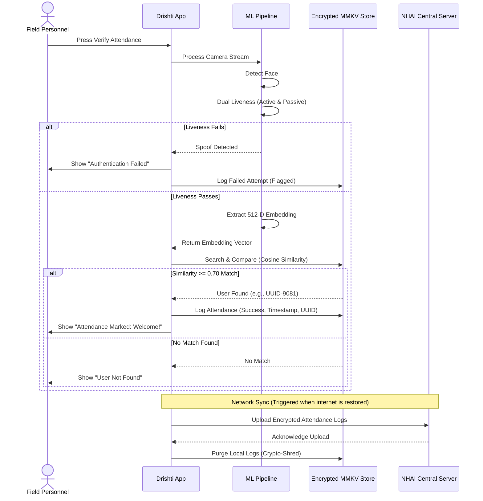

# 🏗️ System Architecture — Drishti

This document describes the high-level system design, machine learning pipeline, secure storage mechanism, and synchronization protocols for the **Drishti** offline biometric attendance platform. 

---

## 👁️ Machine Learning Model Stack

The biometric pipeline runs fully on-device within a low-latency execution loop. The core models are INT8-quantized to minimize storage footprints, maintain memory efficiency, and run at peak framerates without GPU acceleration.

```
       [ Camera Frame Input ]
                 │
                 ▼
     +───────────────────────+
     │ 1. Face Detection     │  <-- BlazeFace (224 KB)
     │ - Bounding Box        │
     │ - Landmark Points     │
     +───────────────────────+
                 │
                 ▼
     +───────────────────────+
     │ 2. Alignment & Preproc│  <-- Affine Transformation
     │ - Rotation Correction │  <-- CLAHE / Retinex Normalization
     │ - 112x112 Crop        │
     +───────────────────────+
                 │
                 ▼
     +───────────────────────+
     │ 3. Dual Liveness Gate │  
     │ - Active Challenge    │  <-- Blink / Smile / Head-Turn (FSM)
     │ - Passive Anti-Spoof  │  <-- MiniFASNet (~1-2 MB)
     +───────────────────────+
                 │
                 ▼
     +───────────────────────+
     │ 4. Embedding Gen      │  <-- MobileFaceNet (5.1 MB)
     │ - 512-D Vector        │
     +───────────────────────+
                 │
                 ▼
     +───────────────────────+
     │ 5. Matching Engine    │  <-- Cosine Similarity Matching
     │ - Score >= 0.70       │
     +───────────────────────+
```

### 1. Face Detection (BlazeFace)
- **Role:** Extracts the location of the face and key facial landmarks (eyes, nose, mouth) in the video frame.
- **Why we use it:** Extremely small (~224 KB) and runs in less than 10 ms.
- **Output:** Bounding box coordinates and 6 key landmarks.

### 2. Face Alignment & Preprocessing
- **Role:** Standardizes the face crop before feeding it into the embedding model.
- **Method:** Uses an **Affine Transformation** to rotate and scale the face based on eye coordinates, ensuring the eyes and nose are mapped to fixed pixel positions.
- **Lighting Correction:** Applies **CLAHE (Contrast Limited Adaptive Histogram Equalization)** and **Retinex filtering** to normalize lighting variations caused by direct sunlight, clouds, or shadows in outdoor construction environments.
- **Output:** A normalized, frontal 112x112 pixel crop.

### 3. Dual-Layer Liveness Gate
To prevent proxy attendance using paper photos, video replays, or masks, the system uses a dual-verification gate:
- **Passive Liveness (MiniFASNet):** A deep neural network that evaluates texture patterns, depth cues, and reflection features from the face crop to determine if it is live human skin vs. print/digital paper/screen medium.
- **Active Liveness (Gesture Challenge):** A finite state machine (FSM) that prompts the user to perform random gestures (e.g., blink eyes, smile, turn head). Eye Aspect Ratio (EAR) and Mouth Aspect Ratio (MAR) are calculated using landmark paths to verify compliance.

### 4. Face Embedding (MobileFaceNet)
- **Role:** Converts the visual representation of the face into a unique mathematical signature.
- **Why we use it:** MobileFaceNet is specifically optimized for mobile devices. Quantized to INT8, it shrinks to a 5.1 MB bundle while retaining high accuracy.
- **Output:** A 512-dimensional numerical vector representing the face structure.

### 5. Cosine Similarity Matcher
- **Role:** Computes the angular distance between the generated vector and the registered vector in the encrypted database.
- **Matching Threshold:** $\ge 0.70$ similarity indicates a successful match.

---

## 🔄 Core Data Flows

### A. Enrollment Flow
During enrollment, the application registers a new worker by taking multiple samples to generate a stable, noise-free template.



### B. Verification Flow
For daily attendance, the app verifies the identity of the worker and logs their entry offline.



---

## 💾 Storage & Cryptographic Security

Drishti keeps biometric and attendance logs highly secure, complying with data privacy laws by never transmitting biometric data.

- **On-Device Storage only:** Stored vectors are one-way embeddings. It is mathematically impossible to reconstruct the human face image from the 512-dimensional numbers.
- **AES-256 Database Encryption:** Local storage is built using an encrypted MMKV instance. All data on disk is encrypted using AES-256 in GCM mode.
- **Hardware Keystore Binding:** The encryption keys are generated randomly on first startup and saved in the device's hardware-backed secure storage:
  - **Android:** Android Keystore System
  - **iOS:** Keychain Services
- **Crypto-Shred Protocol:** To prevent long-term storage of tracking data on the mobile device, synced records are wiped by overwriting the database sector with zero values before deleting the record pointer.

---

## 📡 Offline-First Synchronization Logic

The application features a network-agnostic design:

1. **Local Queueing:** Attendance check-ins (consisting only of UUID, Timestamp, and Liveness result) are stored in an encrypted FIFO queue.
2. **Network Monitoring:** A background listener monitors network state using NetInfo API.
3. **Smart Reconnect Syncing:** When internet connectivity is restored (Wi-Fi or cellular):
   - The sync worker initiates a secure handshake with the NHAI central API server.
   - It transmits the logs in compressed, encrypted batches.
   - Upon receiving a HTTP 200 verification code, it purges the synced queue items.
4. **Resilience against Interruptions:** If connection drops mid-sync, the transaction is rolled back, and the items remain securely queued in local storage until the next reconnection.
