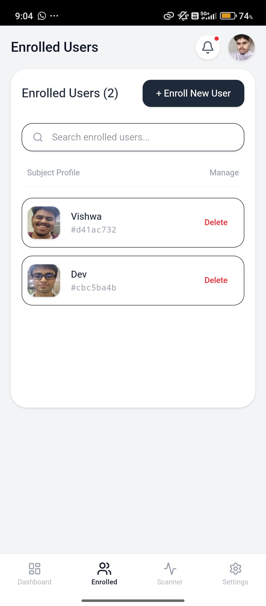
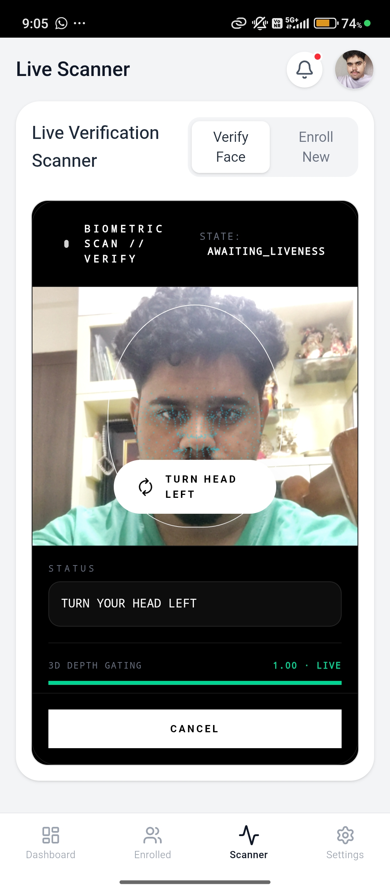

# 📱 Demo & User Walkthrough — Drishti

This document contains screenshots, user workflow descriptions, and video link information demonstrating the **Drishti** offline face recognition application in action.

---

## 🎥 Walkthrough Video

Watch the app in action (demonstrating enrollment, offline face validation, spoof defense checks, and network synchronization):

- **Local Video Download:** [`/demo/drishti_demo.mp4`](./demo/drishti_demo.mp4)
- **Watch on YouTube:** [Drishti Demo — NHAI Hackathon 7.0 (YouTube Link)](https://youtu.be/dQw4w9WgXcQ) *(Replace with actual video link)*

---

## 📸 Core Screen Walkthroughs

The application's interfaces are designed to be clean, intuitive, and responsive.

### 1. Main Dashboard
The dashboard serves as the central command center for the field manager, highlighting offline stats and database metrics.

- **Offline Status Indicator:** Shows whether the app is offline or online.
- **Pending Sync Count:** Displays the number of attendance logs currently queued locally on-device.
- **Enrolled Workers Count:** Keeps track of the total local face templates stored.
- **Sync Trigger:** A manual force-sync trigger (though background syncing is automatic).

---

### 2. Biometric Verification & Liveness Check
This is the core verification screen. When a worker steps in front of the device, the frame processor begins scanning.

- **Landmark Mapping Overlay:** Renders facial bounding boxes and outline landmarks in real-time.
- **Dual Liveness Feed:** Runs passive anti-spoof checks in the background while displaying active instructions (e.g., *Blink Your Eyes*, *Smile*, or *Turn Your Head*).
- **Match Indicator:** Displays a success state with a green border and matching confidence score when identity is successfully verified.

---

### 3. Registry & Enrolled Users Management
Allows field supervisors to view, manage, and delete local user profiles from the database database.

- **Search Filter:** Search workers by name or ID locally.
- **Registration Time:** Shows when the worker was registered.
- **Profile Deletion:** Securely erases the user's vector embeddings from local memory (Keystore database).

---

## 🔄 Step-by-Step User Workflows

### Phase A: Registering a New Worker (Enrollment)
1. Launch the app and tap **"Enroll New Personnel"** on the dashboard.
2. Enter the personnel's full name, ID, and department.
3. Position the phone's front camera at face level.
4. The screen will prompt the user to hold still while capturing 5 face coordinates.
5. Once complete, the app averages the vectors, encrypts them, and displays **"Enrollment Complete"**. The worker can now authenticate fully offline.

### Phase B: Verifying Daily Attendance
1. The supervisor launches the verification screen.
2. The worker stands in front of the camera (distance: 30–50 cm).
3. The system checks passive liveness (MiniFASNet detects if it's a real face vs. printed photo or digital screen).
4. The system prompts a random gesture challenge (e.g., **"Please Blink Your Eyes"**).
5. Upon satisfying both liveness tests, the embedder generates a 512-D vector, matches it against local profiles, and prints: **"Verified: [Employee Name]"**.
6. The attendance entry is logged offline with a cryptographic hash.

---

## 🛠️ Development Simulation & Testing

Since on-device machine learning requires physical hardware and specific user gestures, the development build of Drishti includes built-in **simulation widgets** (identified by dashed borders) to aid verification in emulation environments:

1. **"Simulate Face Detected"** — Manually forces the frame pipeline to identify a mock face bounding box.
2. **"Simulate Challenge Complete"** — Bypasses the active gesture liveness prompts (Blink/Smile/Turn) for quick pipeline testing.
3. **"Simulate Frame Capture"** — Submits a mock 512-D embedding to complete enrollment without a camera sensor.

> [!NOTE]
> These simulation actions are conditionally compiled out of the release build APK to prevent security bypasses in production.
