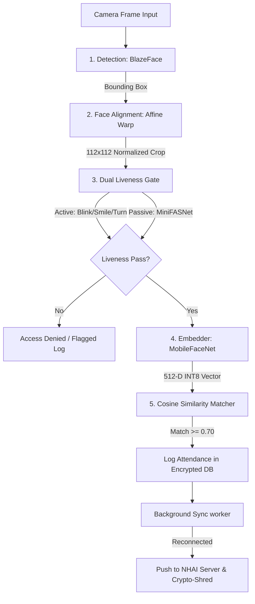

# 🔍 Drishti — Offline Biometric Attendance for NHAI Field Personnel

> **Built for NHAI Hackathon 7.0** | **Team TrenCoders**  
> React Native • On-Device AI • Dual Liveness Verification • Zero Network Dependency

---

## 🧩 What It Solves

Field personnel executing National Highways Authority of India (NHAI) road construction and maintenance projects frequently operate in remote, low-connectivity, or zero-connectivity environments. Traditional cloud-dependent biometric systems fail under these conditions, leading to attendance disputes, proxies, and operational delays.

**Drishti** solves this by providing a **100% offline, on-device face recognition engine** that:
- Performs face detection, landmark alignment, and matching entirely local to the device.
- Implements two layers of anti-spoofing (active gesture prompts + passive MiniFASNet) to eliminate proxy attendance.
- Stores biometric profiles securely as encrypted embeddings (never raw images).
- Caches logs in an encrypted local queue, auto-syncing to NHAI servers once a network connection is detected, followed by a secure purge.

---

## 🚀 Key Specifications

| Metric / Feature | Detail |
| --- | --- |
| **Verification Latency** | **< 1 Second** (End-to-End on mid-range Android devices) |
| **Offline Capability** | **100% On-Device** (No internet required for detection, liveness, or matching) |
| **Model Size** | **~5 MB total bundle** (highly optimized via INT8 quantization) |
| **Liveness Check** | **Dual-Layer** (Active challenge-response + Passive network analysis) |
| **Database Encryption** | **AES-256** local database (MMKV + keystore keys) |
| **Privacy Safeguard** | **Zero raw image storage** (embeddings only) + **Crypto-shred purging** |

---

## ✨ Key Features

- **On-Device Face Processing:** Utilizes state-of-the-art quantized neural networks for real-time inference on standard mobile processors.
- **Two-Layer Anti-Spoofing:** 
  - **Passive Liveness:** MiniFASNet checks for 2D printouts, digital screen replays, and mask attacks.
  - **Active Liveness:** Random gesture challenges (blink, smile, head-turn) driven by a finite state machine.
- **Offline Attendance Syncing:** Logs are queued locally in an encrypted store. The NetInfo background worker detects network reconnection to sync logs to the server and execute a local secure purge (crypto-shred).
- **Sub-Second Matching:** Optimized cosine similarity computation achieves instant verification (< 1s) even against large local registries.

---

## 📸 Screenshots

To help you visualize the application, here is the interface in action (images can be found in the `/screenshots` directory):

| 🖥️ Main Dashboard | 🔍 Scanner Verification | 👥 Enrolled Registries |
| --- | --- | --- |
|  |  |  |

---

## 🏗️ Architecture Overview

The pipeline executes sequentially inside a dedicated React Native Vision Camera Frame Processor to guarantee high performance and low latency:

*For an in-depth explanation of the model architecture, mathematical formulas, and data structure schemas, check the [ARCHITECTURE.md](./ARCHITECTURE.md) document.*

---

## 🛡️ Privacy & Security

We adopt a strict **privacy-by-design** approach:
1. **No Image Storage:** Raw camera images are immediately processed in memory and discarded. No face images are written to disk.
2. **Hardware-Backed Encryption:** Face embeddings and attendance queues are encrypted using AES-256. Encryption keys are generated and stored inside the Android Keystore and iOS Keychain.
3. **Crypto-Shred Purging:** Once attendance is securely synchronized to the central server and an acknowledgment is received, the local log is overwritten and deleted.

---

## 📥 Installation

1. **Download:** Go to the [Releases](https://github.com/ninjacode911/drishti/releases/latest) tab and download the latest `drishti-v1.0.apk`.
2. **Permissions:** Install the APK. You may need to toggle "Install from Unknown Sources" in your Android settings.
3. **Run:** Open the app and grant Camera permissions when prompted. The application is ready to run fully offline.

---

## 👥 Team

Built with ❤️ by **Team TrenCoders**:
* **Vishwajeet Pisal Deshmukh**
* **Navnit A**
* **Devansh Tyagi**

